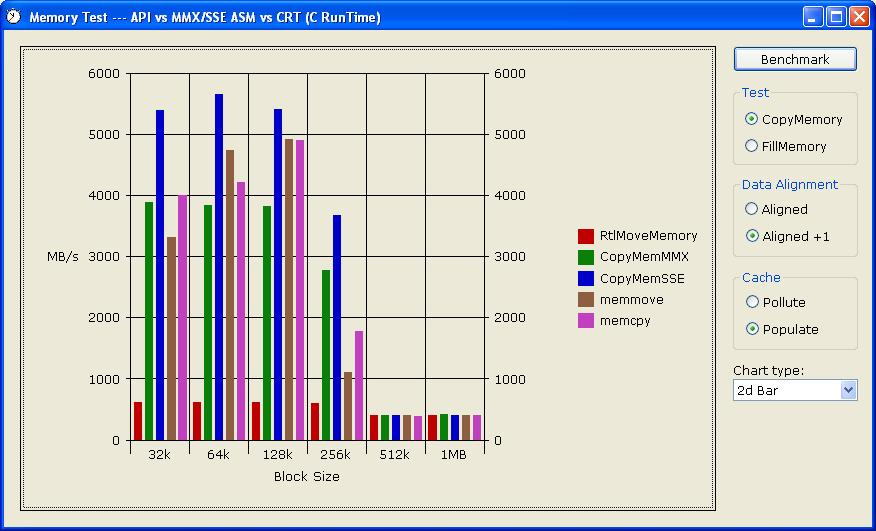



## Copy memory FAST using MMX/SSE\. Updated

### Description

I was wondering whether MMX/SSE instructions could be employed to improve on the performance of CopyMemory for large blocks of data. Well, as you can from the screenshot, in some scenarios huge benefits can be wrought. Though I have to state, overall, the best strategy is to play nice with the cache and ensure that both source and destination are aligned on 16 byte boundaries. Nota Bene: The ASM routines DO NOT work with overlapped source and destination, though why a VB programmer would be doing that, I can't imagine. Don't concern yourself that that a user's CPU might be ancient and not support either MMX or SSE instructions, if those capabilities aren't found, then the cMemory class seamlessly falls back to using the regular api functions. For actual usage, use the cMemory.cls which chooses SSE over MMX, if available, automatically, rather than the cMemTest.cls, as used in the sample project, which was written just so that I could demonstrate both MMX and SSE codes against each other. Just for fun, I also test the equivalent C run-time functions memcpy, memmove & memset. The screenshot was produced on a P4 @ 1.8GHz

See comments below for update details...
 
### More Info
 

             |
---                |---
**Submitted On**   |2003-11-10 16:34:04
**By**             |[Paul Caton](https://github.com/Planet-Source-Code/PSCIndex/blob/master/ByAuthor/paul-caton.md)
**Level**          |Intermediate
**User Rating**    |5.0 (130 globes from 26 users)
**Compatibility**  |VB 6\.0
**Category**       |[Miscellaneous](https://github.com/Planet-Source-Code/PSCIndex/blob/master/ByCategory/miscellaneous__1-1.md)
**World**          |[Visual Basic](https://github.com/Planet-Source-Code/PSCIndex/blob/master/ByWorld/visual-basic.md)
**Archive File**   |[Copy\_memor16711211122003\.zip](https://github.com/Planet-Source-Code/paul-caton-copy-memory-fast-using-mmx-sse-updated__1-49798/archive/master.zip)

